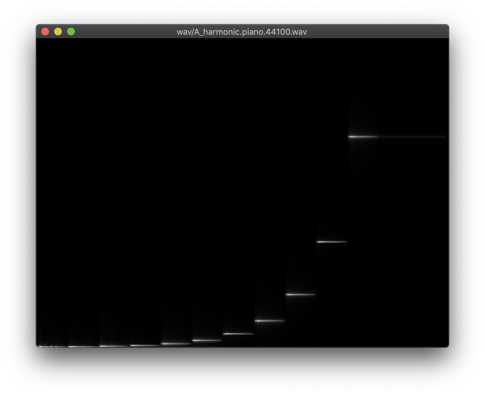
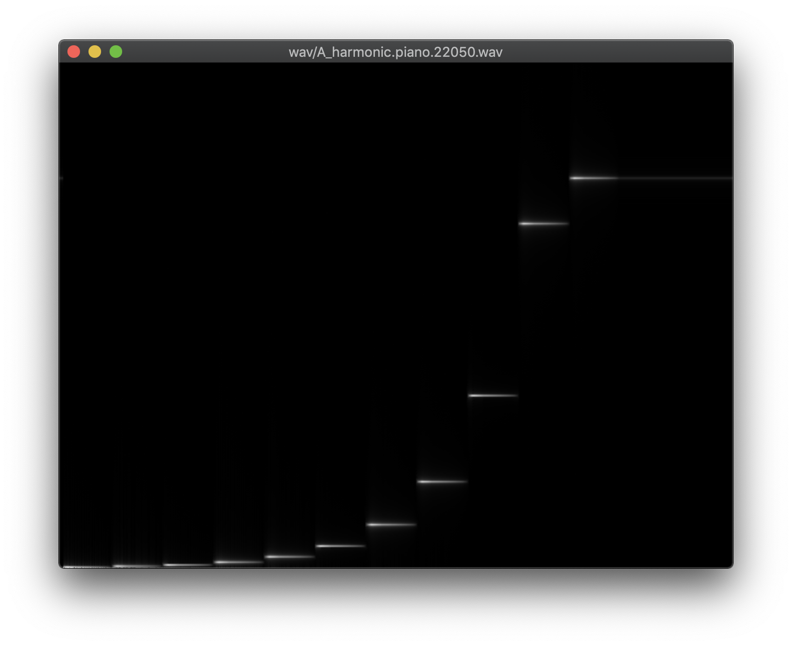
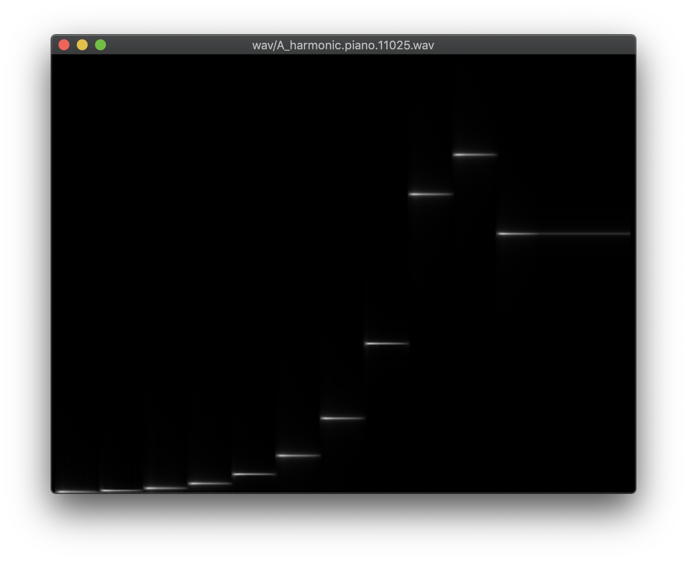
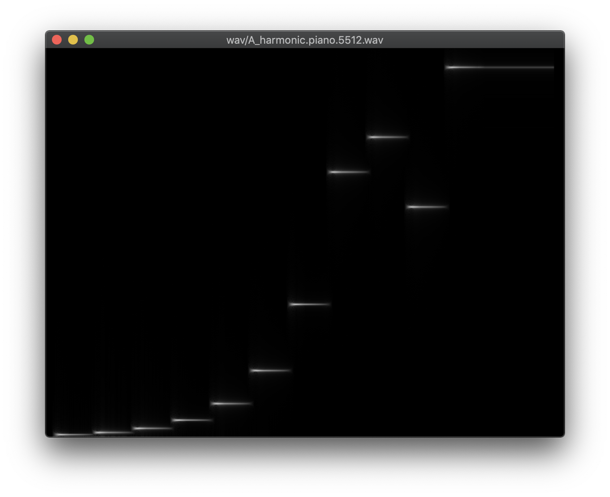
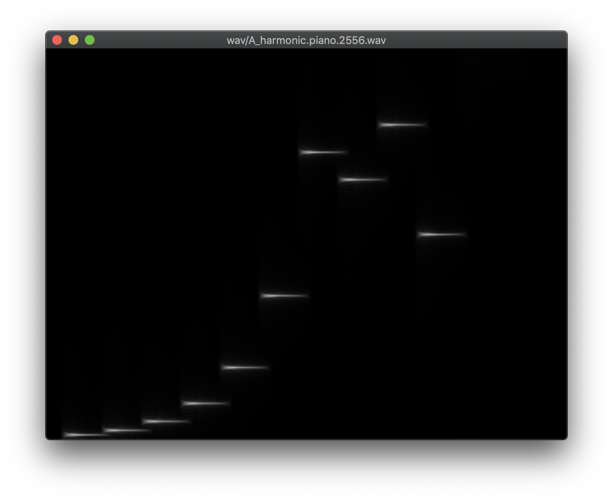

# MAC0317 - Introdução ao Processamento de Sinais Digitais

**Prof.** Marcel Parolin Jackowski

**Aluno** Vitor Santa Rosa Gomes, 10258862, vitorssrg@usp.br

## EP1 - Sintetizador Digital

O program `synthesizer.py` é capaz de transformar arquivos de partitura `.part` ou midi `.mid` em arquivos de áudio digital `.wav`, dado um perfil adsr `.adsr` que descreve uma aproximação das fases do som de um instrumento.

### Funcionalidades

As funcionalidades de `synthesizer.py` estão disponíveis com `python synthesizer.py -h`:

```
usage: synthesizer.py [-h]
                      {note2freq,midi2freq,playwav,readpart,readmidi,part2wav,midi2wav}
                      ...

positional arguments:
  {note2freq,midi2freq,playwav,readpart,readmidi,part2wav,midi2wav}
    note2freq           convert a musical note to its frequency in hertz https
                        ://en.wikipedia.org/wiki/Scientific_pitch_notation
    midi2freq           convert a midi note to its frequency in hertz https://
                        en.wikipedia.org/wiki/Scientific_pitch_notation
    playwav             calls ffplay https://ffmpeg.org/
    readpart            convert a part file into a sheet music
    readmidi            convert a midi file into a sheet music
    part2wav            create a wav file from adsr and part
    midi2wav            create a wav file from adsr and midi

optional arguments:
  -h, --help            show this help message and exit
```

Cada uma das funcionalidades também aceita um argumento `-h` que explica seus argumentos.

1. Para criar um `.wav` a partir de uma partitura, use `python synthesizer.py part2wav [-h] [-s SAMPLERATE] adsrfile partfile wavfile`.
1. Para criar um `.wav` a partir de um midi, use `python synthesizer.py midi2wav [-h] [-s SAMPLERATE] adsrfile midifile wavfile`.
1. Para tocar um `.wav`, use `python synthesizer.py midi2wav [-h] [-s SAMPLERATE] adsrfile midifile wavfile`.

### Dependências

O programa `synthesizer.py` foi testado com `python3.7`. A fim de ter acesso a todos os recursos, são necessários:

* `pip install argh mido numpy scipy`, e
* `ffplay` do `ffmpeg`.

### Compilando os exemplos

Execute `bash ./test.sh` para criar um ambiente com `python` adequado e gerar todos os `.wav` para cada combinação de `.part` ou `.mid` com os `.adsr`.

### Exemplo de *aliasing*

O efeito de *aliasing* em processamento de sinais digitais é transformação de uma classe infinita de diferentes frequências numa única frequência representante dessa classe, por causa da amostragem do sinal. Em particular, as frequências escolhidas como representantes são sempre as de menor valor (por convenção), assim qualquer componente no sinal original com frequência maior que metade da taxa de amostragem sofre *aliasing*, sendo representada por uma outra.

Compilando o `.wav` a partir a escala harmônica do Lá em `A_harmonic.part` com taxas de frequência $44100$, $22050$, $11025$, $5512$ e $2556$ podemos perceber uma progressão do *aliasing* para as notas mais altas, visível nas frequências geradas retratadas nas figuras abaixo, respectivamente.






